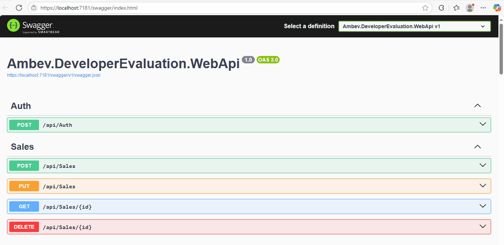
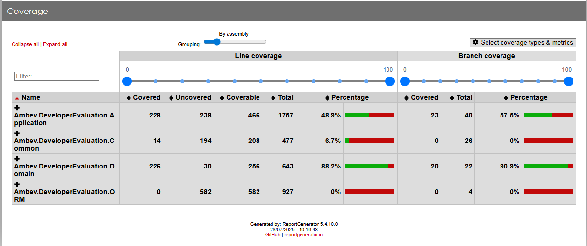

# Desafio Ambev

Aplicação criada com o objetivo de implementar uma Api básica de registro de Vendas e seus itens com as operações: inclusão, alteração, consulta e exclusão.

## Instruções

O que precisa ser instalado na máquina para executar, estender e depurar o projeto:

    Visual Studio Community 2022 ou superior;
    .NET 8 ou superior;
    PostgreSQL (em servidor ou instalado localmente).

Passo a passo para execução

    * Entrar na pasta /src/Ambev.DeveloperEvaluation.WebApi;
    * Adicionar string de conexão do PostgreSQL com os dados de servidor, usuário e senha na chave DefaultConnection do arquivo appsettings.json;
    * Abrir um PowerShell nesse mesmo diretório;
    * Executar o comando: dotnet tool install --global dotnet-ef
    * Rodar migrations com o comando: dotnet ef database update --context DefaultContext
    * Executar o projeto Ambev.DeveloperEvaluation.WebApi no Visual Studio;

## Testes Unitários

Para os testes unitários são usados os frameworks: **xUnit, Faker e NSubstitute**. Para gerar o relatório de cobertura é usado o coverlet através da execução do arquivo `coverage-report.bat` no diretorio raiz. Após execução do arquivo `coverage-report.bat` o relatório pode ser acessado abrindo o arquivo `TestResults/CoverageReport/index.html`.

Abaixo é apresentado uma imagem do relatório. O projeto `Ambev.DeveloperEvaluation.Domain` que possui as principais regras de negócio possui **88.2%** de cobertura.

## Modelo de domínio

Modelo de classes criado para representar os conceitos de Venda e seus itens, além de uma calculadora de descontos que implementa as regras de descontos usando o princípio Open/Closed do SOLID.

		     +---------------+
		     |   IDiscount   |
		     +---------------+
			      ^
			      |
		+------------------------+
		|                        |
    +-----------------------+   +-----------------------+
    | TenPercentDiscount    |   | TwentyPercentDiscount |
    +-----------------------+   +-----------------------+
                |                        |
                +------------------------+
                            ^
                            |
                    +--------------------+
                    | DiscountCalculator |
                    +--------------------+
                            ^
                            |
                        +-----------+		+-------------+
                        |   Sale    | ------->	|  SaleItem   |
                        +-----------+		+-------------+

* **Sale**: classe que representa a entidade Venda;
* **SaleItem**: classe que representa os itens da Venda;
* **DiscountCalculator**: classe que aplica as regras de cálculo de descontos;
* **IDiscount**: interface que define um contrato comum entre as regras de desconto;
* **TenPercentDiscount**: classe que encapsula a regra de aplicação de 10% de desconto;
* **TwentyPercentDiscount**: classe que encapsula a regra de aplicação de 20% de desconto;
